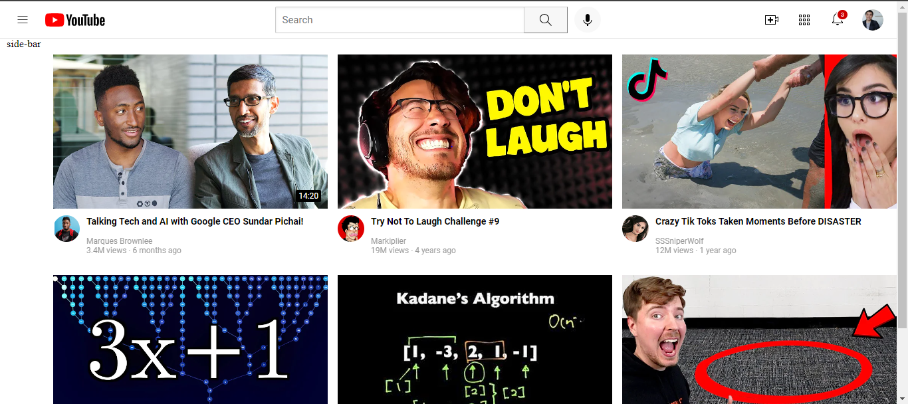

# YouTube Home Page

This project is a simple recreation of the YouTube home page using HTML and CSS. It is a part of my web development learning journey.

## Description

The YouTube Home Page project aims to replicate the layout and design of the YouTube home page using only HTML and CSS. It includes a header with navigation links, a section displaying video thumbnails with titles and descriptions, and a footer.

## Preview

## Technologies Used

- HTML
- CSS

## Usage

You can clone this repository and open the `index.html` file in your web browser to view the YouTube home page replica.

## License

This project is licensed under the [MIT License](LICENSE).
